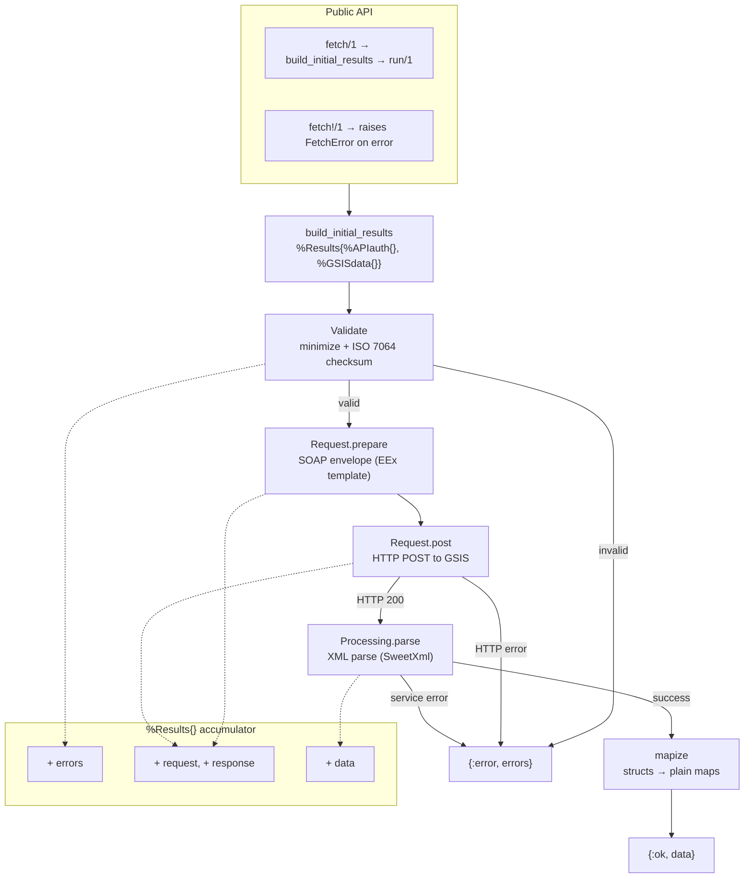
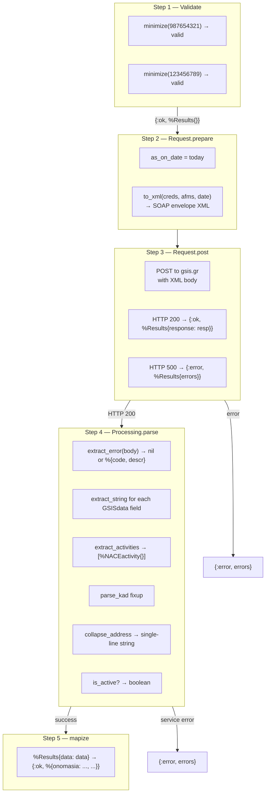
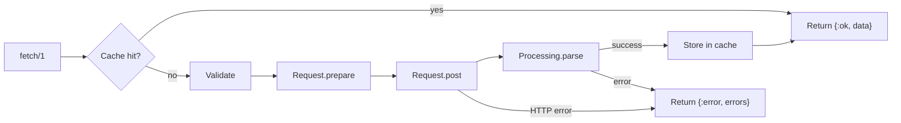

# VatchexGreece — Design Document

## Overview

VatchexGreece is an Elixir client library for the Greek GSIS **RgWsPublic2** SOAP web service. It accepts a VAT ID (ΑΦΜ) and returns structured company registration data: legal name, address, registration date, status, and NACE activity codes.

The public API is two functions: `fetch/1` (returns `{:ok, map}` / `{:error, map}`) and `fetch!/1` (returns the map or raises `FetchError`). Everything else — XML building, HTTP transport, parsing, validation — is an internal pipeline that has evolved through three major revisions (v0.5 → v0.7 → v1.0).

## Architecture



### The `%Results{}` Accumulator

The central data structure that flows through the pipeline:

```elixir
%Results{
  auth:     %APIauth{},      # credentials + caller AFM
  data:     %GSISdata{},     # query target + parsed response fields
  request:  xml_string,      # populated after Request.prepare/2
  response: %Req.Response{}, # populated after Request.post/1
  errors:   %{}              # accumulated error map (key → message)
}
```

Each pipeline step pattern-matches on `%Results{}`. If the errors map is non-empty, subsequent steps short-circuit (`{:error, input}`), so no HTTP call or XML parsing happens for invalid input.

## Module Responsibilities

### `VatchexGreece` (public surface)

- `fetch/1` — keyword list input, delegates to pipeline, unwraps `%Results{}` into `{:ok, map}` or `{:error, errors}`.
- `fetch!/1` — calls `fetch/1`, raises `FetchError` on error.
- `build_initial_results/4` — wraps raw inputs into `%Results{%APIauth{}, %GSISdata{}}`.
- `run/1` — the pipeline: `Validate → Request.prepare → Request.post → Processing.parse`.
- `mapize/1` — recursively converts `%GSISdata{}` and nested `%NACEactivity{}` structs into plain maps for the caller.

### `VatchexGreece.Validate`

VAT ID normalization and validation:

- `minimize/1` — strips `EL`/`GR` prefix, removes whitespace, zero-pads to 9 digits.
- `valid?/1` — runs three boolean checks: digits-only, correct length (9), checksum match.
- `validate/1` — pipeline step; validates both `afm_called_by` and `afm_called_for`, returns `{:error, %Results{}}` with `:validity_source` / `:validity_target` error keys.

**Checksum algorithm**: ISO 7064 (MOD 11,10) — each digit left-to-right is accumulated (`acc = acc * 2 + digit`), then `result = (acc * 2) mod 11 mod 10`. The result must equal the 9th digit.

### `VatchexGreece.Request`

SOAP envelope construction and HTTP transport:

- `to_xml/5` — compiled from `request.xml.eex` via `EEx.function_from_file/4`. Injects credentials, caller/target VAT IDs, and today's date (`as_on_date`) into the WS-Security UsernameToken envelope.
- `prepare/1` — pipeline step; calls `to_xml/5` and stores the XML string in `results.request`.
- `post/1` — pipeline step; POSTs to `https://www1.gsis.gr/wsaade/RgWsPublic2/RgWsPublic2` with `Content-Type: application/xml` header. Non-200 responses add `:http_not_ok` to errors.

### `VatchexGreece.Processing`

XML response parsing using SweetXml:

- `extract_string/2` — XPath-extracts a named element, trims whitespace, collapses internal spaces, returns `nil` for empty strings.
- `extract_error/1` — looks for `error_code` / `error_descr` in the `error_rec` block. Returns `nil` if absent, or `%{code: ..., descr: ...}`.
- `extract_activities/1` — XPath-extracts the `//item` list of firm activities, maps each to `%NACEactivity{}`.
- `parse_kad/1` — handles a GSIS quirk: sometimes `firm_act_code` contains a non-KAD ID while `firm_act_descr` starts with the actual 8-digit KAD followed by the description. Regex `^(\d{8})\s+(.*)$` splits them back out.
- `parse/1` — pipeline step; extracts all `GSISdata` fields from the response, checks for service errors, returns `{:ok, %Results{}}` with the populated data struct or `{:error, %Results{}}` with `:service_error`.

### `VatchexGreece.GSISdata`

Struct holding the query target and all response fields. Keys match the XML element names exactly:

- `:afm` — the queried VAT ID (as provided)
- `:as_on_date` — date the lookup was performed
- `:onomasia`, `:commer_title`, `:legal_status_descr` — company naming/legal status
- `:postal_address`, `:postal_address_no`, `:postal_zip_code`, `:postal_area_description` — address (individual fields from GSIS)
- `:address_collapsed` — single-line single-string version of the postal address (computed in `Processing.parse`)
- `:is_active` — boolean derived from `stop_date` (computed in `Processing.parse`)
- `:regist_date`, `:stop_date` — registration and cessation dates
- `:doy`, `:doy_descr` — tax office code and description
- `:i_ni_flag_descr`, `:deactivation_flag`, `:deactivation_flag_descr`, `:firm_flag_descr`, `:normal_vat_system_flag` — status flags
- `:activities` — list of `%NACEactivity{}` structs

### `VatchexGreece.NACEactivity`

Struct for NACE/KAD activity classification:

- `:code` — 8-digit KAD code
- `:prio` — activity priority (1 = primary / "ΚΥΡΙΑ", 2 = secondary)
- `:descr` — activity description
- `:prio_text` — human-readable priority label

### `VatchexGreece.APIauth`

Struct enforcing required keys: `:username`, `:password`, `:afm_called_by`.

### `VatchexGreece.FetchError`

Exception raised by `fetch!/1`. Fields: `:message` (human-readable) and `:errors` (the error map from the pipeline).

## Data Flow — End to End



## Error Handling Strategy

Errors are accumulated in the `%Results.errors` map as `:key => description` pairs. Each pipeline step only proceeds if errors is empty. Error keys used:

| Key                              | Source           | Meaning                                       |
| -------------------------------- | ---------------- | --------------------------------------------- |
| `%{code: :invalid_vat, descr:}`  | Validate         | Source or target VAT ID failed validation     |
| `%{code: :http_not_ok, descr:}`  | Request.post     | Non-200 HTTP response                         |
| `%{code: :transport_error, descr:}` | Request.post  | Network failure (DNS, timeout, refused)       |
| `%{code: "1001", descr:}`        | Processing.parse | GSIS returned an `error_rec` in the SOAP body |

This design means:

- Validation errors prevent any network call.
- HTTP errors prevent XML parsing.
- Service errors (including auth failures) are returned with their Greek description from the API, not masked as empty data.

## Caching



Caching is implemented via the `VatchexGreece.Cache` protocol, allowing pluggable adapters. The built-in `VatchexGreece.CachexCache` adapter wraps Cachex v4.x and is conditionally compiled — it is only available when Cachex is loaded at runtime.

Key properties:
- Only `{:ok, results}` are cached. Errors (validation, HTTP, service) always bypass the cache.
- Cache key: `"vatchex:{afm_called_for}:{afm_called_by}"` — based on VAT IDs, not credentials.
- Default TTL: 1 hour (configurable via `:cache_ttl` config).
- Zero impact when not used: no extra dependencies, no application config required.

## Key Design Decisions

1. **EEx template compiled at compile time** — `EEx.function_from_file/4` generates a `to_xml/5` function at compile time rather than interpreting the template on every request. This is faster and catches template errors at compile time.

2. **`as_on_date` always sent** — The GSIS reference Java client sends today's date. VatchexGreece does the same for consistency, even though the service ignores it for most lookups.

3. **Endpoint URL without `?wsdl`** — v1.0 sends POST to the service endpoint directly rather than the WSDL URL, matching the reference implementation.

4. **KAD field fixup** — The GSIS service occasionally swaps the KAD code into the description field. `parse_kad/1` detects this pattern (8 digits + spaces + text) and reassigns the fields correctly.

5. **Structs → maps at the boundary** — Internal pipeline uses structs for pattern matching and compile-time guarantees. The public API returns plain maps via `mapize/1`, so callers are not coupled to the struct definitions.

6. **All internal modules are `@moduledoc false`** — Only `VatchexGreece` and `FetchError` appear in generated documentation. The internal pipeline can be restructured without breaking public API contracts.

7. **Optional caching via protocol** — A `VatchexGreece.Cache` protocol allows pluggable cache adapters. The provided `CachexCache` adapter uses Cachex v4.x and is conditionally compiled (only available when Cachex is loaded). Caching is opt-in via the `:cache` option; no dependency is forced on consumers.

## Dependencies

| Dependency         | Purpose                                   |
| ------------------ | ----------------------------------------- |
| `sweet_xml`        | XPath-based XML parsing of SOAP responses |
| `req`              | HTTP client for SOAP POST requests        |
| `cachex` (optional)| In-memory caching via `VatchexGreece.CachexCache` |
| `credo` (dev/test) | Static analysis / linting                 |
| `ex_doc` (dev)     | HexDocs documentation generation          |

## Configuration

None required for basic use. Credentials are passed per-call to `fetch/1`.

### Caching

To enable caching, add a `:cache` option to `fetch/1`:

```elixir
VatchexGreece.fetch(
  afm_called_for: "998144460",
  username: "user",
  password: "pass",
  afm_called_by: "123456789",
  cache: VatchexGreece.CachexCache
)
```

You must have a Cachex instance running in your supervision tree:

```elixir
# mix.exs
{:cachex, "~> 4.1"}

# application.ex
children = [
  {Cachex, name: :vatchex_greece, limit: 10_000},
  ...
]
```

Optional config:

```elixir
# config/config.exs
config :vatchex_greece, :cache_name, :vatchex_greece  # Cachex cache name (default: :vatchex_greece)
config :vatchex_greece, :cache_ttl, 3_600_000       # TTL in ms (default: 1 hour)
```

Caching is strictly optional. If `cache: nil` (default) or Cachex is not loaded, requests bypass the cache entirely.

## Testing

```
mix test
```

85 tests, no external dependencies. The suite covers:

- **Validate** — VAT ID normalization (`EL`/`GR` prefix stripping, 8→9 digit padding, whitespace removal), ISO 7064 checksum validation
- **Processing** — XML response parsing (`extract_string`, `extract_error`, `extract_activities`), KAD field fixup (`parse_kad`)
- **Request** — SOAP envelope generation from EEx template
- **Pipeline** — `fetch/1` input validation short-circuit (invalid VAT IDs never reach the HTTP layer), `fetch!/1` error raising
- **Cache** — cache hit/miss behavior, error caching prevention, protocol dispatch

No integration tests against the live GSIS service are included. Consumers should validate against the service independently.

## Version History (Architectural Significance)

- **v0.5**: Initial SOAP client using HTTPoison + Soap library.
- **v0.7**: Migrated to RgWsPublic2 endpoint, replaced Soap with SweetXml, added Req, introduced `{:ok,}`/`{:error,}` pipeline with `%Results{}` accumulator.
- **v1.0**: Removed legacy `new/4` and `get/1` API. All internal modules made `@moduledoc false`. `fetch/1` and `fetch!/1` are the only supported public functions. Proper service error detection from `error_rec`.
